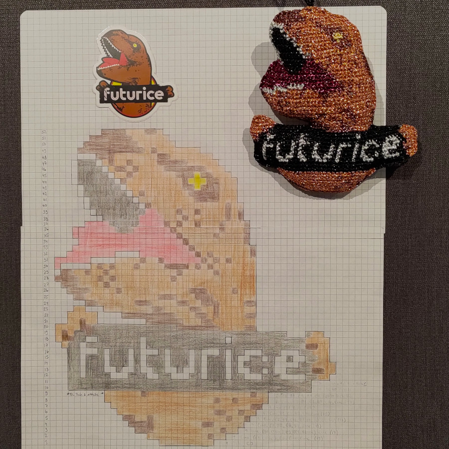
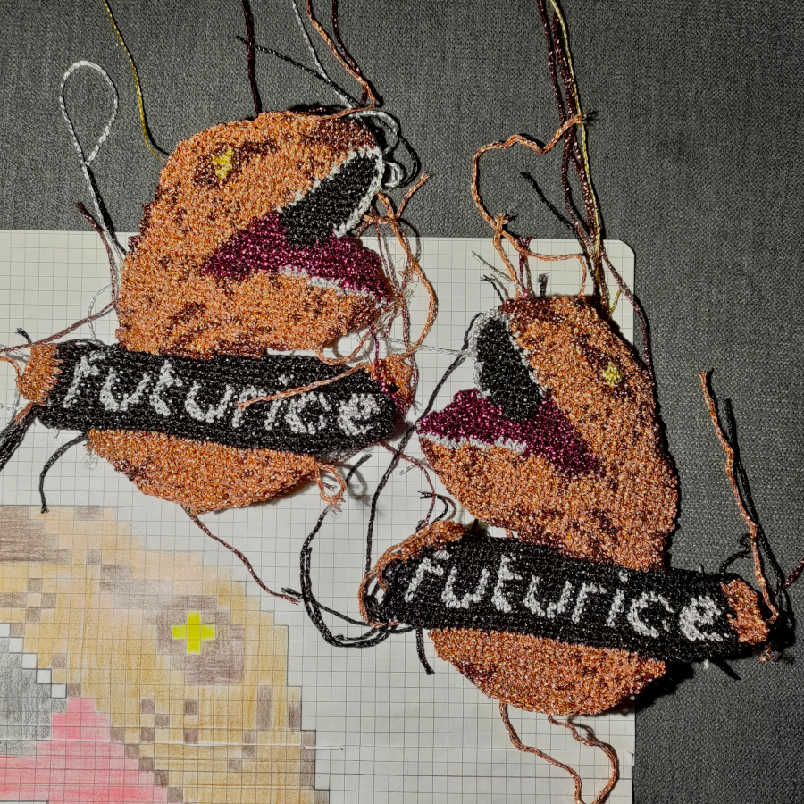
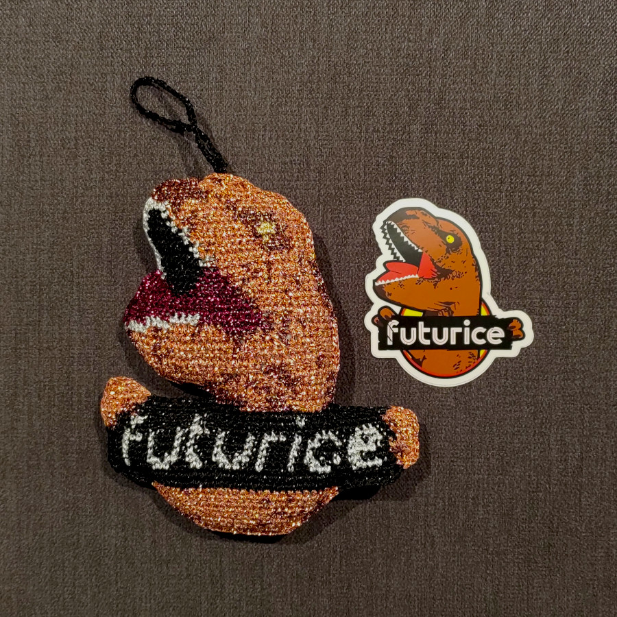
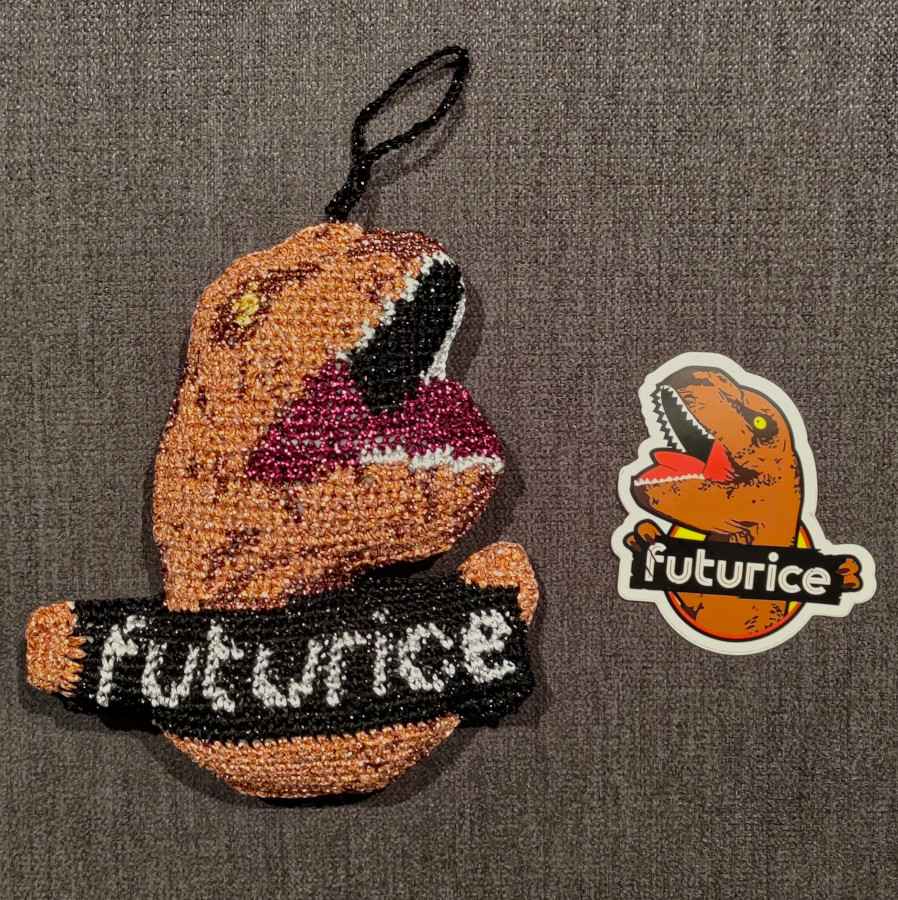

# Futurice T-rex -koriste

Kaikesta sählingistä johtuen, työ on tehty aikalailla lennosta improvisoiden, eikä kirjoitettua ohjetta ole.
Eli kuvasta pitää soveltaa, ja kuvienkin laatu on mitä on. Mutta tulipahan edes valmista.

## Materiaalit

* Filati Fantasia / Anchor artiste metallic / Schoeller Stahl Manuela  
(copper, lava, silver/white, pink, gold/yellow, black)
* 2.0 mm koukku
* täytevanu

## Koko

* 15 cm korkea
* 13 cm leveä

## "Ohjeet"

TODO: lisään tähän myöhemmin ohjeet, miten alkuperäisestä kuvasta piirtyi ruutumalli.

Tee etu- ja takakappaleet erikseen, takakappale pääosin peilikuvana.
**Takakappaleen Futurice-kyltti kannattaa tehdä oikein päin, mutta muista, että käpälät ja mustan alueen osuus pitää
olla etukappaleen peilikuvana**

1. Aloita tekemällä Futurice-kyltit käpälineen.
2. Käännä kyltti ylösalaisin ja virkkaa siihen vatsa.
3. Käännä kyltti oikein päin ja jatka pään tekeminen.
4. Kokoa etu- ja takakappale virkkaamalla reunoista (ohje alempana).

## Ripustin

Tee ketjusilmukoita haluttuun mittaan asti.

## Kokoaminen 

1. Päättele ylimääräiset langanpäät, voit jättää pisimpiä lankoja ympärivirkkausta varten.
2. Asettele nurjat puolet vastakkain mahdollisimman tarkasti, logon oikeinpäin oleva puoli päälle.
3. Aloita ylänurkan tumman ruskeasta väristä ja virkkaa naamaa pitkin eteenpäin, lisää teräviin kulmiin ylimääräisiä kiinteitä silmukoita.
4. Vaihda väriä aina tarpeen mukaan.
5. Virkkaa Futurice-kyltin ympäri ja ala täyttää jatkuvasti, erityisesti nurkkia, jatka virkkaamista yläosaan asti, jätä ripustimelle kolo ja täytä loppuun.
6. Kiinnitä ripustin keskelle yläosaa ompelemalla ja sulje koriste virkkaamalla kuparilla myös ripustinkohdan yli.
8. Päättele langat.

