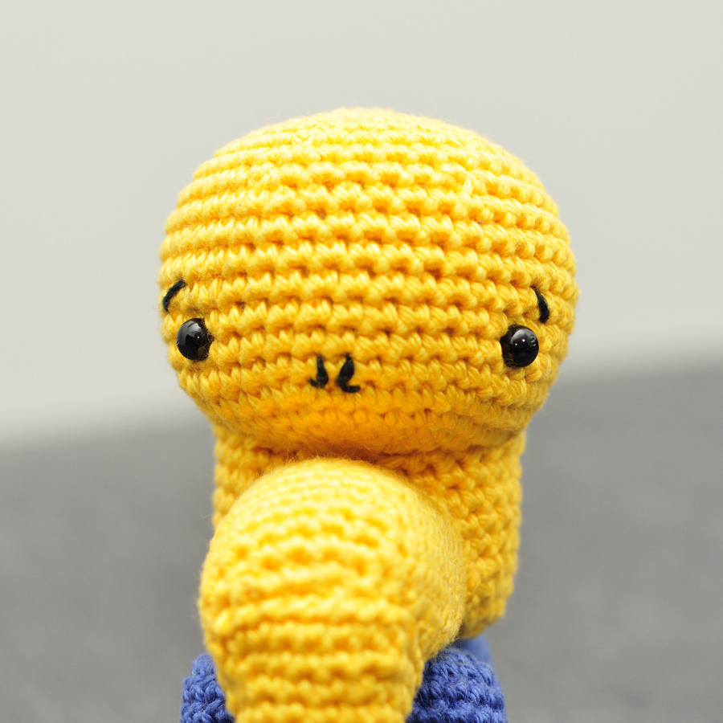
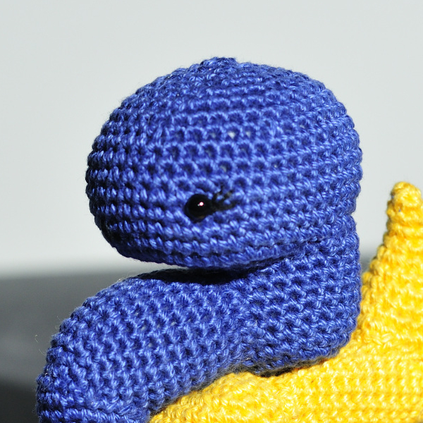
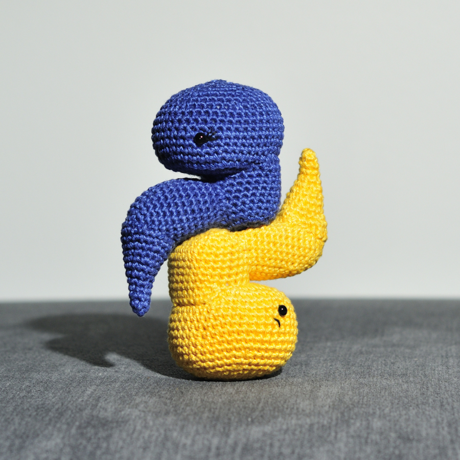

# Python-ohjelmointikielen logo

En löytänyt yhtään mallia [Python-logosta](https://www.python.org/community/logos/) amigurumina, joten oli työstettävä
itse [All about ami:n](https://www.allaboutami.com/snakepattern/) käärmeen pohjalta.

hje löytyy myös ladattavana [PDF:nä](./python-logo.pdf) (sisältää vanhentuneita linkkejä).

#### Materiaalit:

* SCM Catania Originals, tummansininen
* SCM Catania Originals, keltainen
* mustaa virkkauslankaa
* 2.0 ja 2.5 mm koukut
* täytevanu
* turvasilmia 2 kpl
* kartonkia

#### Koko:
11 cm korkea, 9 cm leveä ja 4 cm syvä

#### Termit:
- ks = kiinteä silmukka
- kjs = ketjusilmukka
- ps = piilosilmukka

#### Pää (2 kpl)
2.5 mm koukku
1 kpl tummansininen lanka
1 kpl keltainen lanka

1. 5 kjs
2. 3 ks, 3 lisäys, käännä, 3 ks, 3 lisäys (12) 
3. 4 ks, 2 lisäys, 5 ks, 2 lisäys, 1 ks (14)
4. (1 ks, lisäys) x 7 (21)
5. (2 ks, lisäys) x 7 (28)
6. (3 ks, lisäys) x 7 (35)
7. (4 ks, lisäys) x 7 (42)
8. 42 ks (42)
9. 42 ks (42)
10. 42 ks (42)
11. 42 ks (42)
12. 42 ks (42)
13. 42 ks (42)
14. 42 ks (42)

Asettele silmät, ompele sieraimet mustalla langalla (jos lanka on paksua, käytä vain kahta säiettä). 
Halutessasi tee myös kulmakarvat tai ripset, ripset kannattaa ommella ennen turvasilmän taustakappaleen kiinnittämistä.
Leikkaa kartongista pohjan kokoinen pala ja asettele se pohjalle.

15. (5 ks, vähennys) x 6 (36)
16. 36 ks (36)
17. (4 ks, vähennys) x 6 (30)
18. (3 ks, vähennys) x 6 (24), aloita pään täyttäminen
19. (2 ks, vähennys) x 6 (18)
20. (1 ks, vähennys) x 6 (12), täytä pää tiukaksi
21. vähennys x 6 (6)

Tee lopetukseksi ps ja sulje päättelemällä.

#### Selkä (2 kpl)
2.5 mm koukku
1 kpl tummansininen lanka
1 kpl keltainen lanka

1. 7 kjs 
2. 5 ks, 2x lisäys, käännä, 5 ks, 2x lisäys (16)
3. 6 ks, 2x lisäys, käännä, 7 ks, 2x lisäys, 1 ks (20)
4. (1 ks, lisäys) x 10 (30)
5. 30 ks (30)
6. 30 ks (30)
7. 30 ks (30)
8. 30 ks (30)
9. 30 ks (30)
10. 30 ks (30)
11. 30 ks (30), tee lopuksi ps ja katkaise lanka
12. tee 1 kjs 14. viimeiseen silmukkaan, 13 ks (tämä on lisäkerros niskaan helpottamaan osan kiinnittämistä)

Tee lopetukseksi ps ja jätä lankaa kiinnittääksesi osan päähän.

Leikkaa kartongista sopiva suorakaide niskaan laitettavaksi, näin käärmeen "selkä" pysyy suorana eikä pullistu täyttämisestä.

#### Vartalo (2 kpl)
2.5 mm koukku
1 kpl tummansininen lanka
1 kpl keltainen lanka

1. 5 kjs
2. 3 ks, 2x lisäys, käännä, 3 ks, 2x lisäys (12)
3. 4 ks, 2x lisäys, 5 ks, 2x lisäys, 1 ks (16)
4. (3 ks, lisäys) x 4 (20)
5. 20 ks (20)
6. 20 ks (20)
7. lisäys, 3 ks, lisäys, 5 ks, lisäys, 3 ks, lisäys, 5 ks (24)
8. 24 ks (24)
9. 24 ks (24)
10. 24 ks (24)
11. 24 ks (24)
12. 24 ks (24)
13. 24 ks (24)
14. 24 ks (24)
15. 24 ks (24)

Tee lopetukseksi ps ja jätä lankaa kiinnittääksesi vartalon selkään.

Leikkaa kartongista sopiva suorakaide vartalon pohjalle, jotta se pysyy tasaisena eikä pullistu täyttämisestä.

#### Häntä (2 kpl)
1 kpl tummansininen lanka
1 kpl keltainen lanka

2.0 mm koukku
1. 4 silmukan magic ring (4)
2. (1 ks, lisäys) x 2 (6)
3. 6 ks (6), jatka 2.5 mm koukulla
4. (2 ks, lisäys) x 2 (8)
5. 8 ks (8)
6. (1 ks, lisäys) x 4 (12)
7. 12 ks (12)
8. (3 ks, lisäys) x 3 (15)
9. 15 ks (15)
10. (2 ks, lisäys) x 5 (20)
11. (4 ks, lisäys) x 4 (24), ps
12. tee kjs 8. viimeiseen silmukkaan, 7 ks

Tee lopetukseksi ps ja jätä lankaa kiinnittääksesi hännän vartaloon.

#### Kokoaminen
1. Täytä häntää, mutta jätä hieman pehmeäksi.
2. Kiinnitä häntä vartaloon niin, että lopussa tehty lisäkerros tulee päällimmäiseksi.
3. Aseta kartonki selkään (lisäkerroksen puolelle) ja täytä.
4. Kiinnitä selkä pään takaosaan niin, että kartonki ja lisäkerros tulevat pään taakse.
Ompele ensin kartongin puoleinen reuna siten, että selkä on mahdollisimman suora. 
Täytä selkäosio tiukaksi viimeisestä pienestä raosta ennen kiinnityksen viimeistelyä. 
5. Aseta kartonki vartalon pohjalle ja täytä. 
6. Kiinnitä vartalo pään alle, aloita kiinnitys kartongin puoleisesta reunasta siten, että 
vartalon pohja tulee mahdollisimman suoraksi. Täytä vartalo tiukaksi viimeisestä pienestä 
raosta ennen kiinnityksen viimeistelyä.
7. Tee vastaava kokoaminen toiselle pythonille. 
8. Kiinnitä pythonit vartalon ja selän alaosista toisiinsa tiukasti.

